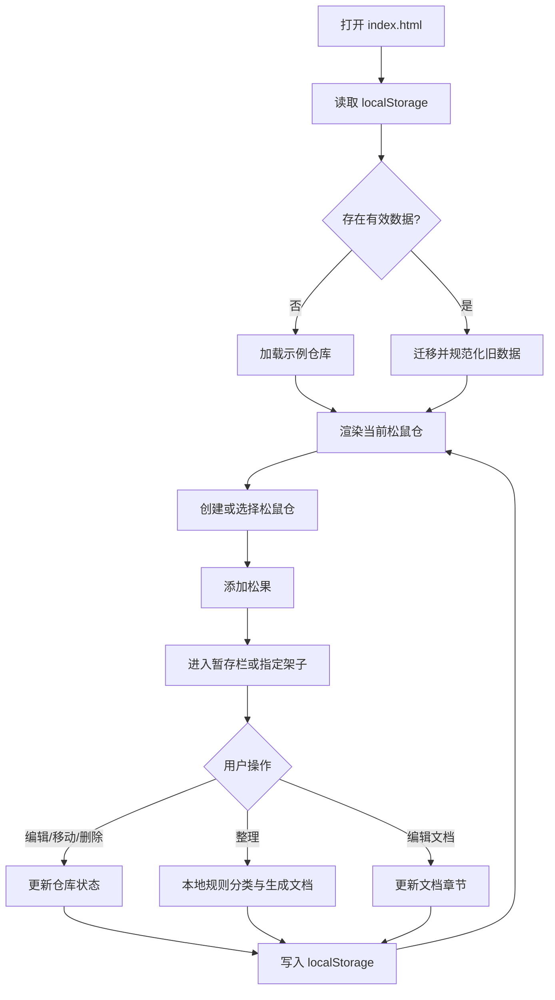
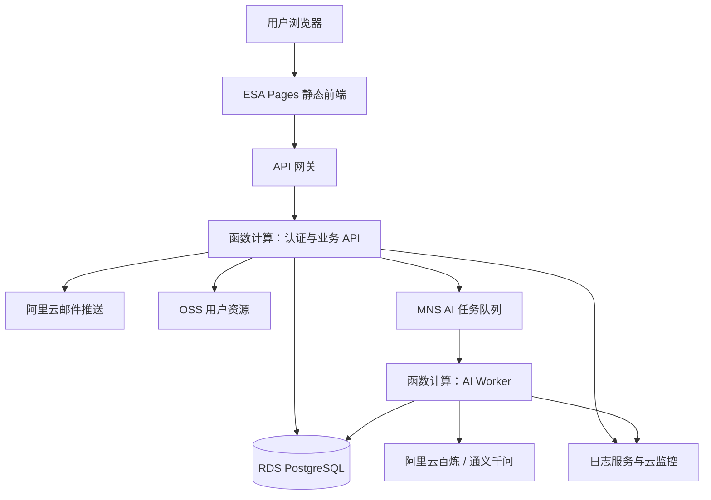
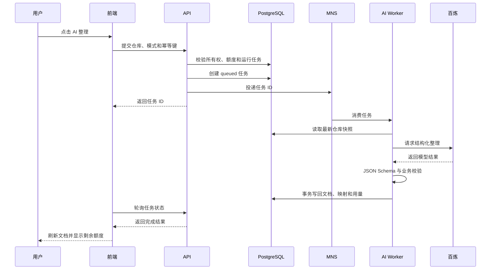

# 松鼠文仓：产品实现链路与公开测试版方案

## 1. 文档说明

本文档用于统一说明松鼠文仓的产品定位、4.0 当前实现链路，以及后续公开测试版的搭建方案。目标读者包括产品、设计、研发、测试、运营和后续参与项目的 AI Agent。

本文使用以下状态标记：

- **已实现**：当前 4.0 代码中已经存在，并可在本地运行。
- **局部实现**：已有界面或本地逻辑，但尚未连接生产服务。
- **规划中**：已经完成方案设计，但尚未在当前代码中实现。
- **非本期范围**：公开测试版暂不建设。

重要边界：当前版本没有账号系统、云端数据库和真实大模型调用。公开测试版章节描述的是后续建设目标，不代表相关能力已经上线。

## 2. 产品概览

### 2.1 产品定位

松鼠文仓是一款面向学习者、内容创作者、产品经理和知识工作者的知识整理工具。它帮助用户将来自文章、课程、聊天、网页和笔记的碎片信息，持续沉淀为结构清晰、可以补充、编辑和复盘的主题文档。

产品不是单次摘要工具。其核心价值是建立以下可持续的信息组织闭环：

```text
收集碎片 → 暂存材料 → 识别主题 → 建立章节 → 生成结构化文档 → 回看原始材料 → 持续补充
```

### 2.2 目标用户

- 经常收集资料但难以形成体系的学生和求职者；
- 需要长期积累行业、项目和方法论知识的产品经理；
- 需要整理选题、研究材料和创作素材的内容创作者；
- 希望借助 AI 整理信息，同时保留人工编辑和原文追溯能力的知识工作者。

### 2.3 核心概念

| 概念 | 定义 | 在产品中的作用 |
|---|---|---|
| 松鼠仓 | 围绕一个主题建立的独立知识库 | 隔离不同主题下的文档、架子和原始材料 |
| 松果 | 用户收集的一条碎片信息 | 作为整理和生成文档的原材料 |
| 暂存栏 | 尚未正式归类的松果集合 | 让用户先收集、后整理，降低输入负担 |
| 松果架 | 与某个文档章节对应的材料集合 | 保存章节与原始材料之间的映射 |
| 结构化文档 | 按章节组织的可阅读内容 | 用于阅读、复盘和继续编辑 |
| 精选松果 | 被标记为重要的原始材料 | 强调关键观点、引用或证据 |

## 3. 产品功能介绍

### 3.1 松鼠仓管理

**状态：已实现**

用户可以：

- 查看多个松鼠仓；
- 创建新的空仓；
- 切换当前仓库；
- 删除仓库；
- 使用鼠标或触控拖拽调整仓库顺序；
- 为仓库上传并裁剪自定义图标。

每个仓库拥有独立的文档、松果架和松果数据。删除仓库时，其关联数据会一并从当前本地状态中移除。

### 3.2 松果收集与暂存

**状态：已实现**

用户通过底部工具栏添加松果。新增材料可以：

- 默认进入暂存栏；
- 直接进入已有松果架；
- 在创建新架子后进入该架子。

暂存栏承担“先记录、后组织”的缓冲作用。新增材料不会被强制立即改变正式文档结构。

### 3.3 松果编辑与流转

**状态：已实现**

用户可以在松果架的修改状态中：

- 编辑松果正文；
- 将松果移动到暂存栏或其他架子；
- 删除松果；
- 查看松果所属架子和精选状态。

对已归档松果的修改会同步更新对应章节的本地复盘内容。

### 3.4 结构化文档

**状态：已实现**

文档区域包括：

- 文档标题；
- 左侧章节目录；
- 章节标题、摘要和要点；
- 章节与原始松果之间的引用关系；
- 文档编辑模式；
- 目录点击跳转和内容搜索。

AI 或本地整理结果不是不可修改的终稿。用户可以继续编辑文档内容。

### 3.5 松果架

**状态：已实现**

松果架是原始材料层，与结构化文档并列存在：

- 第一栏为暂存栏；
- 后续架子与文档章节对应；
- 展开时显示右侧材料面板；
- 支持展开、折叠、架内搜索和修改状态；
- 松果卡片按内容长度排列。

该设计使用户既能阅读整理结果，也能追溯每个章节的原始依据。

### 3.6 整理能力

**状态：局部实现**

当前“整理”按钮调用本地规则引擎，不调用真实 AI：

- 根据仓库名称和松果内容选择预设主题画像；
- 根据关键词给松果架定义评分；
- 将松果分配给得分最高的架子；
- 在得分相同的情况下优先分配给当前材料较少的架子；
- 根据架子和松果生成结构化文档；
- 支持整理暂存松果或全部重新整理。

代码中已经保留 API 整理入口，但该入口当前会抛出未实现错误，且功能开关 `USE_API_ORGANIZER` 为 `false`。

### 3.7 当前不具备的能力

以下能力尚未在 4.0 中实现：

- 用户注册和登录；
- 云端保存、备份和跨设备读取；
- 真实大模型整理；
- 服务端权限校验；
- AI 调用额度和成本控制；
- 账号注销与云端数据删除；
- 公开分享和多人协作；
- 付费体系。

## 4. 当前用户操作链路



### 4.1 启动链路

1. `index.html` 创建 `#app` 主容器和 Toast 状态区域。
2. 浏览器以 ES Module 方式加载 `app.js`。
3. `app.js` 从 `squirrel-warehouse-mvp` 键读取 `localStorage`。
4. `normalizeWarehouseState` 将旧版嵌套结构迁移为当前分区结构。
5. 示例集合版本发生变化时，应用按当前逻辑加载示例仓库集合。
6. `resetTransientState` 重置弹窗、拖拽、搜索和编辑等临时 UI 状态。
7. `render` 根据当前状态生成页面，并通过 `bindEvents` 绑定交互。

### 4.2 交互更新链路

当前前端采用单页状态驱动方式，没有引入前端框架：

```text
用户事件
  → 事件处理函数修改当前 state 或 hydrated warehouse
  → commitWarehouse / persistWarehouseRecord 写回分区状态
  → saveState 持久化到 localStorage
  → render 重新生成界面
  → showToast 提供操作反馈
```

### 4.3 仓库创建链路

1. 用户打开创建仓库对话框并输入名称。
2. `createEmptyWarehouseRecord` 创建仓库元数据、默认文档、默认架子和空松果集合。
3. `persistWarehouseRecord` 将四类数据分别写入对应分区。
4. 新仓库成为当前活动仓库。
5. `saveState` 将状态保存到浏览器。
6. 页面重新渲染并显示成功提示。

### 4.4 松果新增链路

1. 用户输入松果正文。
2. 应用根据用户选择确定目标：暂存栏、已有架子或新架子。
3. 新松果获得本地生成的 ID、创建时间、状态和架子 ID。
4. 如果目标是新架子，先创建架子，再关联松果。
5. 更新仓库时间并写回全局状态。
6. 保存到 `localStorage` 并重新渲染。

### 4.5 文档编辑链路

1. 用户进入文档编辑模式。
2. 输入过程更新临时文档草稿。
3. 用户保存后，草稿覆盖当前仓库的文档内容。
4. 仓库更新时间刷新并持久化。
5. 用户取消时丢弃草稿，不修改持久化数据。

### 4.6 本地整理链路


当前内置三类画像：

- 产品经理主题；
- 人性与沟通主题；
- 通用主题。

其本质是确定性的关键词规则，不具备大模型的语义理解、生成质量和泛化能力。

## 5. 当前技术实现

### 5.1 技术栈

| 层级 | 当前实现 |
|---|---|
| 页面 | 原生 HTML5 |
| 样式 | 原生 CSS、响应式规则、自定义字体和插画资源 |
| 应用逻辑 | 原生 JavaScript ES Modules |
| 状态管理 | `app.js` 内的单一运行时状态对象 |
| 持久化 | 浏览器 `localStorage` |
| 整理能力 | 本地关键词评分与规则分类 |
| 本地服务 | Node.js 静态文件服务器 |
| 测试 | Node test runner 与 UI 内容检查脚本 |

### 5.2 数据结构

当前持久化结构按仓库 ID 分区：

```js
{
  version,
  activeWarehouseId,
  warehouses: {
    byId,
    order
  },
  documents: {
    byWarehouseId
  },
  shelves: {
    byWarehouseId
  },
  pinecones: {
    byWarehouseId
  }
}
```

职责划分：

- `warehouses.byId`：仓库名称、更新时间、图标等元数据；
- `warehouses.order`：仓库展示顺序；
- `documents.byWarehouseId`：每个仓库的结构化文档；
- `shelves.byWarehouseId`：每个仓库的松果架；
- `pinecones.byWarehouseId`：每个仓库的原始松果。

这种分区结构避免不同仓库的数据互相混入，也为后续云端按仓库保存 JSON 快照提供迁移基础。

### 5.3 数据访问模式

`warehouse-management.js` 提供仓库数据边界：

- `normalizeWarehouseState`：规范化当前结构，并迁移旧版嵌套数据；
- `hydrateWarehouseRecord`：将多个分区组装为完整仓库对象；
- `persistWarehouseRecord`：将完整仓库重新拆分并写回各分区；
- `createEmptyWarehouseRecord`：创建空仓库及默认内容；
- `removeWarehouseRecord`：同步删除仓库及全部关联分区；
- `reorderWarehouseRecords`：只修改展示顺序，不修改仓库内容。

### 5.4 UI 状态与持久化状态

持久化状态包括仓库、文档、架子、松果、活动仓库和数据版本。

临时 UI 状态包括：

- 搜索词；
- 面板展开状态；
- 当前编辑对象；
- 文档草稿；
- 创建和删除确认弹窗；
- 图标裁剪参数；
- 拖拽过程状态；
- Toast 消息。

保存前会重置或排除临时状态，避免刷新页面后恢复到不完整的编辑和拖拽现场。

### 5.5 关键文件索引

| 文件 | 职责 |
|---|---|
| `index.html` | 页面入口、应用容器和模块加载 |
| `app.js` | 状态初始化、UI 渲染、事件处理和业务流程编排 |
| `styles.css` | 页面布局、视觉系统、响应式和交互状态 |
| `warehouse-management.js` | 仓库数据迁移、组装、持久化、删除和排序 |
| `organizer.js` | 本地规则整理、主题画像选择和文档生成 |
| `example-warehouses.js` | 示例仓库与示例集合版本 |
| `warehouse-management.test.mjs` | 仓库数据结构、迁移、删除和排序测试 |
| `organizer.test.mjs` | 本地整理规则测试 |
| `test-ui-content.cjs` | UI 结构和关键文案检查 |
| `server.mjs` | 本地静态服务入口 |
| `PRODUCT.md` | 产品定位、功能和现状说明 |

### 5.6 本地运行与验证

```bash
npm start
```

默认访问地址为 `http://127.0.0.1:5173/`。

执行完整检查：

```bash
npm run check
```

该命令依次执行 JavaScript 语法检查、仓库管理测试、整理器测试和 UI 内容检查。

## 6. 当前实现的主要限制

### 6.1 数据限制

- 数据只存在当前浏览器；
- 清理浏览器数据后可能无法恢复；
- 没有服务端备份；
- 自定义图标以浏览器数据形式保存，容易占用本地存储；
- 本地生成 ID 不适合作为公开服务的唯一安全标识。

### 6.2 账号与安全限制

- 没有用户身份；
- 没有资源所有权校验；
- 没有会话、限流、审计和注销机制；
- 当前静态服务仅用于本地开发，不是生产 API 服务。

### 6.3 AI 限制

- 当前整理器只识别预设关键词；
- 主题画像数量有限；
- 无法稳定处理复杂语义和跨主题材料；
- 没有模型输出校验、任务队列、重试和费用记录。

## 7. 公开测试版目标

### 7.1 测试范围

**状态：规划中**

公开测试版主要服务中国大陆用户，计划逐步开放至 500 人，包含：

- 邮箱验证码登录；
- 登录后的云端保存；
- 同一账号在不同设备读取相同数据；
- 首次登录时导入当前浏览器的 4.0 数据；
- 使用阿里云百炼通义千问进行真实 AI 整理；
- 数据隔离、账号注销和数据删除；
- AI 额度、全站费用熔断、日志、告警和备份。

公开测试版只支持私有知识库。公开分享、多人协作、团队空间、实时协同和付费不属于本期范围。

### 7.2 已确认产品限制

| 项目 | 公开测试版限制 |
|---|---|
| 总体规模 | 最多约 500 名测试用户 |
| 每用户松鼠仓 | 最多 10 个 |
| 每用户 AI 整理 | 每天最多 3 次 |
| 单次整理输入 | 最多约 2 万个汉字 |
| 并发 AI 任务 | 同一用户最多 1 个运行中任务 |

## 8. 公开测试版总体架构



### 8.1 服务职责

| 组件 | 主要职责 |
|---|---|
| ESA Pages | 静态前端、HTTPS、自定义域名和边缘发布 |
| API 网关 | `/api` 统一入口、基础限流和访问日志 |
| API 函数 | 验证码、会话、仓库 CRUD、数据导入和 AI 任务创建 |
| AI Worker | 调用百炼、校验输出、事务写回和记录用量 |
| RDS PostgreSQL | 用户、会话、仓库、任务和用量数据 |
| MNS | AI 任务排队、削峰和失败重试 |
| 邮件推送 | 发送邮箱验证码 |
| OSS | 保存自定义图标及未来导出文件 |
| 日志与监控 | 非正文日志、指标、费用和异常告警 |

前端不得持有数据库密码、百炼 API Key、邮件密钥或 OSS 长期密钥。所有敏感操作必须经过服务端。

## 9. 公开测试版核心实现链路

### 9.1 邮箱验证码登录

```text
提交邮箱
  → API 按邮箱和 IP 限流
  → 生成 6 位验证码
  → 数据库保存验证码哈希和有效期
  → 阿里云邮件推送发送验证码
  → 用户提交验证码
  → 服务端校验并使验证码失效
  → 创建会话
  → 通过 Secure、HttpOnly、SameSite=Lax Cookie 保持登录
```

默认安全规则：

- 验证码 10 分钟过期；
- 同一邮箱 60 秒内不能重复发送；
- 每个邮箱每天最多发送 10 次；
- 每个 IP 每天最多发送 30 次；
- 连续错误 5 次后当前验证码失效；
- 会话默认有效 7 天，可续期但最长不超过 30 天；
- 数据库只保存验证码和会话令牌的哈希。

### 9.2 云端保存

公开测试版采用“关系数据 + 仓库 JSON 快照”的混合模型：

- 用户、验证码、会话、任务和用量使用独立关系表；
- 每个松鼠仓的文档、架子和松果继续以一个 JSON 快照保存；
- 仓库记录包含 `user_id` 和 `version`；
- 所有查询必须同时匹配资源 ID 和登录用户 ID；
- 保存时执行乐观锁检查，防止旧页面覆盖新数据。

保存链路：

```text
前端提交仓库 ID、状态和 version
  → API 从会话读取 user_id
  → 校验仓库所有权和数据结构
  → 按 warehouse_id + user_id + version 更新
  → 成功后 version + 1
  → 返回新版本
  → 前端显示“已保存到云端”
```

如果版本冲突，页面提示用户刷新或保留本地副本，不进行静默覆盖。

### 9.3 本机数据导入

首次登录后检测旧版 `localStorage`：

1. 显示本机仓库数量和导入说明；
2. 用户明确确认后上传；
3. 服务端校验版本、数量、大小和字段；
4. 使用导入幂等键避免网络重试生成重复数据；
5. 云端已有数据时不自动覆盖；
6. 导入成功后云端成为事实来源；
7. 本地数据只作为缓存或用户保留的副本。

### 9.4 真实 AI 整理



AI 任务必须：

- 使用幂等键，避免重试造成重复生成和重复计费；
- 在 API 和 Worker 两处检查额度；
- 最多自动重试 2 次可恢复的模型超时；
- 对输出执行 JSON Schema 和业务规则校验；
- 只在校验成功后以数据库事务覆盖文档；
- 失败时保留原文档并返回可解释错误；
- 记录模型、Token、耗时、状态和费用估算，但不在普通日志中记录正文。

## 10. 公开测试版数据模型

| 表或存储 | 主要内容 |
|---|---|
| `users` | 规范化邮箱、状态、创建和注销时间 |
| `email_challenges` | 验证码哈希、过期时间、尝试次数和使用状态 |
| `sessions` | 用户 ID、令牌哈希、过期和撤销时间 |
| `warehouses` | 用户 ID、名称、顺序、版本和仓库 JSONB 快照 |
| `ai_jobs` | 状态、幂等键、模型、Token、错误和费用估算 |
| `usage_daily` | 每位用户每天的 AI 次数和 Token 用量 |
| `uploaded_assets` | OSS 对象键、文件类型、大小和删除状态 |
| OSS | 自定义图标及未来导出文件 |

## 11. 前端需要新增的产品状态

公开测试版前端需要在现有界面上增加：

- 登录页和邮箱验证码倒计时；
- 登录状态和退出入口；
- 首次登录的本机数据导入；
- 保存中、已保存、离线、失败和版本冲突状态；
- AI 排队中、处理中、成功、失败和可重试状态；
- 当日剩余 AI 次数；
- 隐私与模型处理告知；
- 账号注销和数据删除确认。

本地 `organizer.js` 可以继续作为开发降级工具或测试基线，但正式 AI 结果必须来自服务端任务，不能由前端直接持有模型密钥调用百炼。

## 12. 安全、隐私与成本控制

### 12.1 安全边界

- 正式环境全部使用 HTTPS；
- API 校验会话、`Origin`、CSRF 和资源所有权；
- 生产数据库不直接暴露到公网；
- 密钥存放在阿里云密钥管理或函数环境中；
- OSS 禁止公共写入，并限制上传类型、大小和尺寸；
- 日志不得包含验证码、Cookie、密钥、松果正文或完整模型输入输出；
- 注销后立即撤销全部会话，并异步删除数据库与 OSS 数据。

### 12.2 AI 费用保护

- 每用户每天最多 3 次整理；
- 同一用户只能有 1 个运行中任务；
- 单次输入最多约 2 万汉字；
- 设置函数和 Worker 并发上限；
- 设置全站每日 Token 或金额上限；
- 达到全站上限后停止新 AI 任务，但保留数据读取和编辑；
- 对百炼消费、邮件发送、函数错误、数据库连接和队列积压设置告警。

### 12.3 合规准备

正式公开前需要：

- 购买并实名认证域名；
- 根据部署区域和服务形式完成适用的 ICP 备案；
- 准备隐私政策和用户协议；
- 说明用户材料会发送给模型服务处理；
- 提供账号注销与数据删除机制；
- 核对个人实名认证主体对备案、邮件和长期商业化的限制。

## 13. 搭建阶段与交付物

### 阶段 1：云端基础设施

目标：建立开发、预发布和生产环境的资源边界。

交付物：

- 域名与 DNS 方案；
- ESA Pages 项目；
- API 网关与函数计算项目；
- RDS PostgreSQL、MNS、OSS、日志和监控资源；
- 独立环境配置和密钥管理；
- 基础费用告警。

### 阶段 2：账号与数据后端

目标：完成邮箱登录和安全的云端数据访问。

交付物：

- 数据库迁移；
- 验证码发送与验证接口；
- 会话创建、续期、退出和撤销；
- 仓库 CRUD、数量限制和所有权校验；
- 版本控制与冲突响应；
- 自动化认证和越权测试。

### 阶段 3：前端云端化

目标：将本地状态切换为登录后的云端事实来源。

交付物：

- 登录与验证码 UI；
- API 客户端和统一错误处理；
- 云端加载和保存状态；
- 本地数据导入；
- 离线、冲突和失败恢复；
- 现有功能回归测试。

### 阶段 4：真实 AI 整理

目标：以异步方式安全调用百炼。

交付物：

- MNS 任务队列；
- AI Worker；
- 百炼模型适配层；
- 提示词和 JSON Schema；
- 幂等、额度、重试和费用记录；
- AI 任务状态 UI；
- 模型质量样例集和回归测试。

### 阶段 5：安全与公开测试准备

目标：完成上线前的安全、运维和合规闭环。

交付物：

- 隐私政策、用户协议和模型处理告知；
- 账号注销与数据删除；
- 日志脱敏和安全审计；
- 数据库备份及恢复演练；
- 监控仪表和告警；
- 灰度、回滚和故障处理手册。

### 阶段 6：灰度发布

目标：从小范围验证逐步扩大到 500 人。

发布顺序：

1. 开发环境完成自动化测试；
2. 预发布环境邀请 5 至 10 人验收；
3. 首批开放 50 人并观察至少一周；
4. 指标和费用稳定后逐步扩大至 500 人。

## 14. 测试与验收重点

### 14.1 当前版本持续回归

- 仓库创建、删除、切换和排序；
- 仓库数据隔离与旧结构迁移；
- 松果新增、编辑、移动和删除；
- 文档编辑与章节跳转；
- 本地整理和重新整理；
- 自定义图标上传与裁剪；
- 桌面和移动端关键布局。

### 14.2 公开测试版新增验证

- 验证码过期、限流、错误次数和重复使用；
- 会话续期、退出、撤销和过期；
- 用户之间的读取、更新和删除越权；
- 仓库数量上限、版本冲突和幂等保存；
- 本机数据导入、断网、重试和重复导入；
- AI 日额度、输入上限、并发和幂等任务；
- 百炼超时、无效输出、重试和事务回滚；
- AI 处理中刷新页面后的任务恢复；
- 全站费用熔断后仍可读取和编辑数据；
- 注销后的会话失效和数据删除；
- 备份数据的实际恢复。

## 15. 关键监控指标

产品指标：

- 邮箱注册成功率；
- 首次创建松鼠仓比例；
- 首次添加松果比例；
- 首次 AI 整理完成率；
- 本机数据导入成功率；
- 日活跃用户和次日留存。

技术指标：

- API 错误率和响应时间；
- 云端保存失败率和版本冲突率；
- AI 排队时间、执行时间和成功率；
- MNS 队列积压；
- 数据库连接数和慢查询；
- 每日 Token、邮件和云资源费用；
- 注销数据删除任务完成率。

## 16. 公开测试版完成标准

满足以下条件后，公开测试版才可以逐步开放：

- 用户能通过邮箱验证码稳定登录和退出；
- 每个用户只能访问自己的数据；
- 4.0 本地仓库可以由用户确认后安全导入；
- 云端保存具有明确状态，不会静默丢失或覆盖数据；
- AI 整理异步执行，失败不会破坏原文档；
- 用户额度和全站费用熔断生效；
- 日志不记录用户正文和敏感凭据；
- 账号注销和数据删除可用；
- 数据库备份通过恢复演练；
- 预发布环境通过自动化、安全和人工验收；
- 域名、备案、隐私政策和用户协议满足实际发布要求；
- 前端与数据库均有可执行的回滚方案。

## 17. 相关文档

- `PRODUCT.md`：产品定位、核心概念和当前功能说明；
- `docs/fragmented-information-processing-principles.md`：碎片信息整理原则；
- `docs/superpowers/specs/2026-08-25-public-beta-cloud-ai-design.md`：公开测试版云端和 AI 详细架构设计；
- `docs/superpowers/plans/`：已有功能的历史实施计划；
- `docs/superpowers/specs/`：已有功能的历史设计文档。

## 18. 给后续 AI Agent 的读取提示

1. 先阅读本文档理解产品、当前实现和目标架构。
2. 再阅读 `PRODUCT.md` 获取产品语义和核心概念。
3. 涉及公开测试版时，必须阅读 `2026-08-25-public-beta-cloud-ai-design.md` 获取安全和架构约束。
4. 修改仓库数据结构前，先阅读 `warehouse-management.js` 及其测试。
5. 修改整理逻辑前，先区分 `organizer.js` 的本地规则与规划中的服务端 AI Worker。
6. 不得将规划中能力描述为已上线能力。
7. 不得将数据库、百炼、邮件或 OSS 密钥写入前端或提交到 Git。
8. 修改完成后至少执行 `npm run check`，并根据改动补充相应自动化和人工验收。
