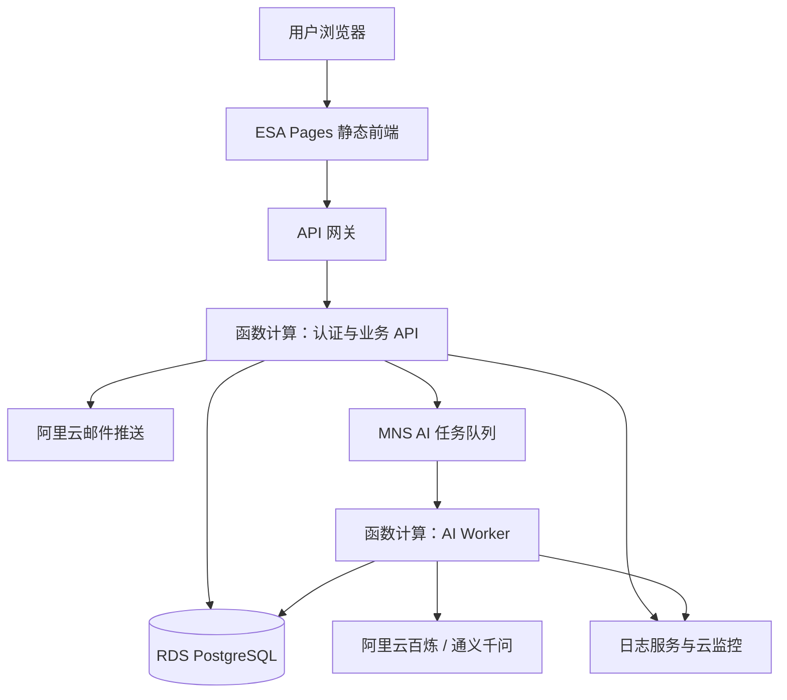

# 松鼠文仓：产品实现链路与公开测试版方案

> 2026-08-30 交互规则更新：新增松果始终进入不限数量的暂存栏；暂存栏为空时不可整理。整理分为“保持当前分区”（仅合并暂存松果并保留人工修改）和“全部重新整理”（使用全部松果替换现有文档）。松果架取消精选能力，普通态只展示文字，管理态统一编辑和删除。

## 1. 文档说明

本文档统一说明松鼠文仓的产品定位、4.0 当前实现和公开测试版目标方案。目标读者包括产品、设计、研发、测试、运维和参与项目的 AI Agent。

本文使用以下状态标记：

- **已实现**：当前 4.0 代码已经具备，并可在本地运行；
- **待改造**：当前代码具有旧版行为，公开测试版将使用本文定义的新行为；
- **公开测试版**：已经确认并进入实施范围；
- **后续版本**：本轮公开测试完成后再评估建设。

当前 4.0 使用浏览器本地数据和本地规则整理。服务端已实现 PostgreSQL 认证、会话和松鼠仓 repository，以及生产模式的 fail-closed 组装；真实数据库验收仍待专用测试库执行。公开测试版仍需建设前端云数据源、真实邮件和真实 AI 整理能力。各章节分别标注现状与目标，研发实现以“公开测试版”规则为准。

## 2. 产品定位与核心结构

松鼠文仓是一款知识整理工具。用户持续收集来自文章、课程、聊天、网页和笔记的碎片材料，产品将这些材料整理成结构清晰、可以编辑和回看原文的主题文档。

核心闭环为：

```text
收集松果
  → 暂存新材料
  → 选择保持当前分区或全部重新整理
  → AI 增量合并暂存材料，或使用全部松果重建结构化文档
  → 服务端按文档章节派生松果架
  → 每条松果获得唯一章节归属
  → 用户阅读、修订并继续补充松果
```

### 2.1 核心概念

| 概念 | 定义 | 作用 |
|---|---|---|
| 松鼠仓 | 围绕一个主题建立的独立知识库 | 隔离不同主题的数据和整理任务 |
| 松果 | 用户收集的一条原始材料 | 作为 AI 整理的唯一内容输入 |
| 暂存栏 | 自上次整理后新增、尚未归档的松果集合 | 可不限数量积累；非空时允许整理 |
| 结构化文档 | AI 整理生成并可由用户继续修改的主要阅读产物 | 支持增量合并或全量重建 |
| 松果架 | 服务端按文档章节派生的材料集合 | 保存章节与原始松果的唯一归属 |

### 2.2 数据权责

- 原始松果构成长期保存的材料事实；
- 保持当前分区时，AI 读取暂存松果和当前文档上下文；
- 全部重新整理时，AI 读取仓库名称和全部原始松果；
- 人工文档修改属于当前文档版本；
- 保持当前分区成功后，现有标题、摘要、要点和人工批注保持不变，只追加新材料或必要的新分区；
- 全部重新整理成功后，AI 新文档整体替换当前文档；
- 整理失败时，当前文档、松果架和松果位置保持原样；
- 每条松果在一次整理结果中归属一个章节；
- 松果架由服务端根据文档章节和松果 ID 映射确定性生成。

## 3. 4.0 当前实现

### 3.1 已实现功能

当前 4.0 已经具备：

- 多仓库创建、切换、删除和拖拽排序；
- 内置仓库图标和名称配色；
- 松果新增、编辑和删除；
- 暂存栏和松果架；
- 文档目录、章节、摘要、要点、搜索和编辑；
- 章节与原始松果引用；
- 支持保持当前分区的增量整理，以及使用全部松果的本地重整；
- 浏览器 `localStorage` 持久化；
- 旧版数据迁移；
- Node.js 自动化检查。

### 3.2 当前技术栈

| 层级 | 当前实现 |
|---|---|
| 页面 | 原生 HTML5 |
| 样式 | 原生 CSS 和响应式规则 |
| 应用逻辑 | 原生 JavaScript ES Modules |
| 状态管理 | `app.js` 单一运行时状态对象 |
| 持久化 | 浏览器 `localStorage` |
| 整理能力 | 本地关键词评分和规则分类 |
| 本地服务 | Node.js 静态文件服务器 |
| 测试 | Node test runner 和 UI 内容检查脚本 |

### 3.3 当前持久化结构

```js
{
  version,
  activeWarehouseId,
  warehouses: {
    byId,
    order
  },
  documents: {
    byWarehouseId
  },
  shelves: {
    byWarehouseId
  },
  pinecones: {
    byWarehouseId
  }
}
```

`warehouse-management.js` 负责数据规范化、旧结构迁移、仓库组装、分区持久化、删除和排序。该结构继续作为公开测试版仓库 JSON 快照的迁移基础。

### 3.4 公开测试版改造点

公开测试版将当前交互收敛为以下规则：

- 新松果统一进入暂存栏；
- 用户通过集中管理模式编辑和删除松果内容；
- AI 统一决定整理后的章节归属；
- 暂存栏非空时，整理入口提供“保持当前分区”和“全部重新整理”；
- 松果架承担追溯展示职责；
- 仓库使用内置图标和名称配色；
- 登录后的云端快照成为正式数据来源。

目标交互直接使用不限数量的暂存栏、双模式整理、AI 唯一归属和内置图标，现有旧入口统一由目标入口替代。

## 4. 公开测试版功能范围

### 4.1 用户能力

公开测试版提供：

1. 邮箱验证码登录；
2. 云端仓库创建、切换、重命名、排序和删除；
3. 松果新增、集中编辑和删除；
4. 当前结构化文档阅读和编辑；
5. 保持当前分区的增量整理，以及使用全部松果重新整理；
6. 松果架和章节来源追溯；
7. 首次登录时整批导入本机 4.0 数据；
8. 多设备读取同一账号的云端数据；
9. 退出当前设备；
10. 注销账号并删除云端数据。

### 4.2 使用限制

| 项目 | 限制 |
|---|---|
| 测试规模 | 最多约 500 名用户 |
| 每用户仓库 | 最多 10 个 |
| 每日 AI 整理 | 每用户最多 3 次 |
| 单次 AI 输入 | 最多约 2 万个汉字 |
| 活动 AI 任务 | 每用户最多 1 个 |
| 单仓写入 | 同一时间执行一次保存或一次 AI 整理写回 |

### 4.3 后续版本范围

以下能力归入后续版本：

- 自定义图标和文件上传；
- 完整离线编辑；
- 多设备内容合并和差异比较；
- 文档版本历史；
- AI 结果预览和选择性应用；
- AI 模型和参数选择；
- 任务取消；
- 公开分享和多人协作；
- 团队空间、实时协同和付费体系。

## 5. 公开测试版交互状态

用户只需要理解四种核心状态：

| 状态 | 页面表现 | 可用操作 |
|---|---|---|
| 保存中 | 显示“正在保存…” | 当前输入继续保留 |
| 已保存 | 显示“已保存” | 正常编辑和整理 |
| 整理中 | 显示“正在重新整理，仓库已进入只读状态” | 阅读、切换仓库 |
| 操作失败 | 显示简明原因 | 重试、刷新或重新登录 |

后台继续记录任务细节，前端将 `queued` 和 `running` 统一呈现为“整理中”。

### 5.1 全部重新整理

确认文案统一为：

> 将使用仓库中的全部松果重新生成文档和松果架。当前文档中的人工修改将在整理成功后被替换。整理期间该仓库进入只读状态。

用户确认后：

1. 前端完成当前待保存变更；
2. API 创建 AI 任务并锁定仓库；
3. 当前仓库进入只读状态；
4. 用户可以阅读和切换其他仓库；
5. 整理成功后前端加载新版本；
6. 整理失败后前端继续使用原版本。

### 5.2 多设备冲突

服务端发现修订号冲突时返回 `409 REVISION_CONFLICT`。前端停止当前仓库编辑并显示：

> 内容已在其他设备更新。刷新后将加载最新内容，当前设备尚未保存的修改将被放弃。

用户点击“刷新”后加载服务端最新快照。公开测试版使用刷新解决冲突。

### 5.3 网络中断

网络中断后，页面保留已加载内容用于阅读，并暂停正式编辑。输入框中的当前草稿保留在页面内存中。网络恢复后，前端重新加载云端数据。

公开测试版的 `localStorage` 用于旧数据导入标记、非敏感 UI 偏好和可选只读缓存。云端快照承担登录用户的正式持久化职责。

## 6. 总体架构



| 组件 | 职责 |
|---|---|
| ESA Pages | 静态前端、HTTPS、自定义域名和边缘发布 |
| API 网关 | `/api` 统一入口、限流和访问日志 |
| API 函数 | 验证码、会话、仓库、导入和 AI 任务创建 |
| AI Worker | 模型调用、输出校验、事务写回和用量记录 |
| RDS PostgreSQL | 用户、会话、仓库、任务和用量数据 |
| MNS | AI 任务排队、重复投递保护和失败重试 |
| 邮件推送 | 邮箱验证码发送 |
| 日志与监控 | 非正文日志、运行指标、费用和异常告警 |

公开测试版使用内置仓库图标，基础设施由页面、API、数据库、任务队列、AI Worker、邮件和监控服务组成。

## 7. 仓库数据与云端保存

### 7.1 仓库快照

每个仓库使用一条 JSONB 快照保存文档、松果架和松果。仓库记录同时保存：

- `schema_version`：JSON 快照格式版本；
- `revision`：乐观锁修订号；
- `status`：`ready` 或 `organizing`；
- `active_ai_job_id`：当前 AI 任务。

格式版本和数据修订号分别承担结构迁移与并发控制职责。

### 7.2 自动保存

前端采用防抖自动保存：

```text
用户修改
  → 等待 800 毫秒
  → 提交仓库快照和 revision
  → 服务端条件更新
  → 返回新的 revision
  → 前端显示“已保存”
```

每个仓库同时发送一个保存请求。保存期间产生的新修改继续保持 dirty 状态，当前请求完成后进入下一次保存。

服务端按照以下条件更新：

```text
warehouse_id 匹配
+ user_id 匹配
+ revision 匹配
+ status = ready
```

成功后 `revision + 1`。各类异常返回稳定错误码：

| 错误码 | 含义 | 前端动作 |
|---|---|---|
| `AUTH_REQUIRED` | 会话失效 | 进入登录页 |
| `WAREHOUSE_ORGANIZING` | 仓库正在整理 | 刷新并进入只读状态 |
| `REVISION_CONFLICT` | 其他设备已更新 | 提示用户刷新 |
| `VALIDATION_FAILED` | 快照格式错误 | 保留页面内容并提示保存失败 |

### 7.3 仓库写入规则

- `ready` 状态接受用户保存；
- `organizing` 状态接受 AI Worker 的条件写回；
- AI 任务创建事务将仓库从 `ready` 切换为 `organizing`；
- AI 任务结束事务将仓库恢复为 `ready`；
- 仓库删除、松果修改和文档编辑统一遵循仓库状态；
- 数据库条件更新和唯一约束承担最终并发保护。

## 8. 邮箱登录与会话

### 8.1 登录链路

```text
提交邮箱
  → 规范化邮箱
  → 按邮箱和 IP 检查发送频率
  → 生成 6 位验证码
  → 保存验证码哈希和有效期
  → 发送验证码
  → 用户提交验证码
  → 数据库原子核销验证码
  → 创建用户和会话
  → 设置安全 Cookie
```

### 8.2 安全规则

- 邮箱去除首尾空格并转换为小写；
- 验证码有效期为 10 分钟；
- 新验证码生成后，同一邮箱的旧验证码失效；
- 同一邮箱 60 秒内发送一次；
- 每个邮箱每天最多发送 10 次；
- 每个 IP 每天最多发送 30 次；
- 连续错误 5 次后当前验证码失效；
- 数据库通过条件更新保证验证码只核销一次；
- 会话默认有效 7 天，滑动续期上限为 30 天；
- 每台设备持有独立会话；
- 退出撤销当前会话；
- 注销撤销全部会话；
- Cookie 使用 `Secure`、`HttpOnly` 和 `SameSite=Lax`；
- 前端和 API 使用同站域名与 `/api` 路径；
- API 校验会话、`Origin`、CSRF Token 和资源所有权。

## 9. 本机数据导入

首次登录、云端仓库为空且浏览器存在 4.0 数据时，页面提供一次整批导入：

```text
检测本机数据
  → 显示仓库数量
  → 用户确认全部导入
  → 前端规范化旧结构
  → 服务端验证整批数据
  → 数据库事务创建全部仓库
  → 返回导入结果
  → 本地记录已导入标记
```

导入规则：

- 云端仓库为空时开放导入；
- 用户选择“全部导入”或“稍后处理”；
- 本地仓库数量上限为 10 个；
- 整批数据通过一个事务写入；
- 任一仓库校验失败时，整批数据保持原样；
- 服务端为仓库和内部对象生成新 ID，并在事务内重建引用；
- 导入幂等键覆盖整批请求；
- 导入成功后保留原 `localStorage` 数据并写入已导入标记；
- 本地缓存按照登录用户 ID 分区；
- 示例仓库按照普通仓库参与数量校验。

## 10. AI 整理

### 10.1 任务创建

用户点击“全部重新整理”后，API 在一个数据库事务中完成：

1. 锁定仓库记录；
2. 校验仓库所有权；
3. 校验仓库状态为 `ready`；
4. 校验客户端 `revision`；
5. 校验用户当日额度和活动任务；
6. 校验全部松果输入长度；
7. 创建 `queued` 任务；
8. 保存 `input_revision` 和幂等键；
9. 设置仓库 `status = organizing` 和 `active_ai_job_id`；
10. 当日 AI 使用次数加一；
11. 提交事务并投递 MNS 消息。

同一用户的 `queued` 或 `running` 任务共享一个数据库唯一约束。幂等键在用户范围内保持唯一。

仓库进入 `organizing` 后，API 拒绝该仓库的用户写入。Worker 读取该修订号对应的稳定松果集合。

### 10.2 模型输出

模型通过一次结构化调用返回文档和松果 ID 映射：

```json
{
  "document": {
    "title": "文档标题",
    "sections": [
      {
        "id": "section-1",
        "title": "章节标题",
        "summary": "章节摘要",
        "points": ["要点一", "要点二"],
        "pineconeIds": ["pinecone-1", "pinecone-3"]
      }
    ]
  }
}
```

模型可以生成“其他材料”章节承接异质材料。服务端根据 `sections[].pineconeIds` 派生松果架，架子名称、顺序和材料集合与文档章节保持一致。

### 10.3 输出校验

服务端执行以下硬校验：

- JSON Schema 校验通过；
- 文档至少包含一个章节；
- 章节 ID 唯一；
- 每个章节至少包含一条松果；
- 输入松果 ID 集合与输出松果 ID 集合完全一致；
- 每个输入松果 ID 在输出中出现一次；
- 标题、摘要、要点和章节数量满足长度限制。

网络超时、模型临时错误、无效 JSON和映射校验失败触发一次后台自动重试。自动重试沿用原任务和原用户额度。

### 10.4 原子写回

Worker 在一个数据库事务中检查：

```text
warehouse.status = organizing
+ warehouse.active_ai_job_id = 当前任务 ID
+ warehouse.revision = input_revision
```

条件成立后整体写入：

- 新文档；
- 服务端派生的松果架；
- 全部松果的唯一位置；
- 清空暂存状态；
- `revision + 1`；
- 仓库恢复 `ready`；
- 任务更新为 `succeeded`；
- Token 和费用估算写入用量记录。

任务失败时，事务只更新任务状态并将仓库恢复为 `ready`。当前文档、松果架和松果位置保持原样。

### 10.5 任务状态

数据库使用以下任务状态：

```text
queued → running → succeeded
queued → failed
running → failed
queued → expired
running → expired
```

前端呈现规则：

- `queued`、`running`：整理中；
- `succeeded`：加载新仓库版本；
- `failed`、`expired`：整理失败，原内容保持原样。

定时恢复任务处理超过执行时限的 `queued` 和 `running` 记录，更新为 `expired`，解除仓库锁并保留原版本。

### 10.6 MNS 重复投递

Worker 通过条件更新将任务从 `queued` 抢占为 `running`。其他消费者读取到非 `queued` 状态后结束处理。已完成任务收到重复消息时直接确认消息。

Worker 记录 `attempt_count`、`started_at`、`expires_at` 和 `finished_at`。任务租约过期后由恢复任务执行统一解锁。

### 10.7 额度规则

- API 成功创建任务时使用一次当日额度；
- 创建事务失败时额度保持原值；
- 后台自动重试沿用本次额度；
- 模型调用发生后，本次额度完成使用；
- 每日额度按照北京时间自然日计算；
- 前端只展示当日剩余次数；
- 全站使用数据库原子计数控制每日 AI 任务硬上限；
- 云平台费用告警承担金额监控；
- 全站上限触发后，数据阅读和编辑继续运行。

## 11. 数据模型

| 表 | 主要字段和职责 |
|---|---|
| `users` | 规范化邮箱、账号状态、创建时间、删除时间 |
| `email_challenges` | 验证码哈希、有效期、错误次数、核销状态 |
| `sessions` | 用户 ID、令牌哈希、有效期、撤销时间 |
| `warehouses` | 用户 ID、名称、顺序、格式版本、修订号、状态、活动任务和 JSONB 快照 |
| `ai_jobs` | 用户、仓库、输入修订号、幂等键、状态、模型、尝试次数、Token、错误码和费用估算 |
| `usage_daily` | 用户每日 AI 次数、Token 和费用估算 |

关键数据库约束：

- `users.email_normalized` 唯一；
- 仓库查询和更新同时匹配 `id` 与 `user_id`；
- 每用户最多 10 个有效仓库，由事务和数据库约束共同保证；
- 每用户同时存在一个活动 AI 任务；
- `ai_jobs(user_id, idempotency_key)` 唯一；
- 保存更新同时匹配仓库 `revision`；
- AI 写回同时匹配任务 ID、仓库状态和输入修订号。

## 12. API 范围

### 12.1 认证

```text
POST   /api/auth/email-code
POST   /api/auth/verify
GET    /api/auth/session
POST   /api/auth/logout
DELETE /api/account
```

### 12.2 仓库

```text
GET    /api/warehouses
POST   /api/warehouses
GET    /api/warehouses/:id
PUT    /api/warehouses/:id
DELETE /api/warehouses/:id
PUT    /api/warehouses/order
```

### 12.3 导入与 AI

```text
POST /api/import
POST /api/warehouses/:id/organize
GET  /api/ai-jobs/:id
```

仓库内容统一通过 JSON 快照保存。松果、文档和松果架使用仓库接口完成持久化。

API 使用稳定错误结构：

```json
{
  "error": {
    "code": "REVISION_CONFLICT",
    "message": "内容已在其他设备更新"
  }
}
```

## 13. 账号注销与数据删除

注销链路为：

```text
用户申请注销
  → 邮箱验证码再次确认
  → 用户状态改为 deleting
  → 撤销全部会话
  → 拒绝新的登录和写入
  → 活动 AI 任务停止写回
  → 异步删除仓库和业务数据
  → 用户记录脱敏并标记 deleted
```

删除任务具有幂等性并执行失败重试。系统仅保留删除结果、任务时间和错误码。数据库备份按照已公布的备份保留周期自然过期。

## 14. 安全、隐私和成本控制

### 14.1 安全边界

- 正式环境统一使用 HTTPS；
- 前端和 API 使用同站部署；
- API 校验会话、`Origin`、CSRF Token 和资源所有权；
- 生产数据库位于受控网络；
- 密钥存放于阿里云密钥管理或函数环境；
- 日志记录请求 ID、用户内部 ID、状态、耗时和错误码；
- 日志排除验证码、Cookie、密钥、松果正文和完整模型输入输出；
- 数据库查询统一携带资源 ID 和登录用户 ID；
- 注销立即撤销全部会话。

### 14.2 成本控制

- 每用户每天最多创建 3 个 AI 任务；
- 每用户同时运行 1 个 AI 任务；
- 单次输入最多约 2 万个汉字；
- Worker 使用固定并发上限；
- 全站使用每日 AI 任务硬上限；
- 百炼、邮件、函数、数据库和队列分别设置费用与异常告警；
- 达到全站上限后，系统继续提供数据读取、编辑和保存。

### 14.3 发布准备

- 完成域名实名认证和适用的 ICP 备案；
- 发布隐私政策和用户协议；
- 明确告知松果内容会发送至模型服务处理；
- 提供账号注销和数据删除入口；
- 核对个人实名认证主体对备案、邮件服务和长期商业化的适用条件。

## 15. 实施阶段

### 阶段 0：固定契约

交付物：

- 版本化仓库 JSON Schema；
- AI 输入输出 JSON Schema；
- REST API 请求、响应和错误码；
- AI 任务状态机；
- 仓库锁定与修订号规则；
- 数据库迁移和关键约束；
- 开发、预发布、生产环境配置边界。

### 阶段 1：前端规则收敛

交付物：

- 新松果统一进入暂存栏；
- 用户编辑和删除松果；
- 全部重新整理成为唯一入口；
- 松果架改为追溯展示；
- 仓库只读状态；
- 内置图标和名称配色；
- 更新后的本地规则模拟器和回归测试。

### 阶段 2：账号和云端仓库

交付物：

- 邮箱验证码和会话；
- 仓库 JSONB CRUD；
- 自动保存串行队列；
- 乐观锁和冲突刷新；
- 多设备读取；
- 认证、越权和并发测试。

### 阶段 3：AI 纵向链路

交付物：

- AI 任务创建事务；
- 仓库整理锁；
- MNS 队列；
- AI Worker；
- 百炼结构化调用；
- 输出校验和服务端架子派生；
- 原子写回；
- 任务轮询、自动重试和超时解锁。

### 阶段 4：导入、额度和注销

交付物：

- 本机数据整批导入；
- 用户每日额度；
- 全站 AI 任务熔断；
- 账号注销与异步删除；
- 日志、告警、备份和恢复演练。

### 阶段 5：灰度发布

发布顺序：

1. 开发环境通过自动化测试；
2. 预发布环境邀请 5 至 10 人验收；
3. 首批开放 50 人并观察至少一周；
4. 技术指标和费用保持稳定后逐步扩大至 500 人。

## 16. 测试与验收

### 16.1 数据和保存

- 仓库创建、切换、重命名、排序和删除；
- 每用户仓库数量限制；
- 仓库 JSON Schema 和旧结构导入；
- 自动保存请求保持串行；
- 保存期间的新修改进入下一次保存；
- 修订号冲突返回 `409 REVISION_CONFLICT`；
- 整理中的仓库拒绝用户写入；
- 用户之间的读取、更新和删除权限隔离；
- 网络中断后页面进入只读状态；
- 冲突刷新加载服务端最新版本。

### 16.2 登录和导入

- 验证码过期、限流、错误次数和原子核销；
- 新验证码使旧验证码失效；
- 会话续期、退出、撤销和过期；
- 整批导入成功；
- 任一仓库校验失败时整批保持原样；
- 导入请求重试保持幂等；
- 新 ID 与内部引用正确重建；
- 不同登录用户使用独立本地导入标记。

### 16.3 AI 整理

- 创建任务原子锁定仓库；
- 同一用户同时创建一个活动任务；
- 保持当前分区时仅暂存松果进入新增材料输入，并携带当前文档上下文；
- 保持当前分区时旧引用完整保留，暂存松果在结果中恰好出现一次；
- 全部重新整理时全部松果进入模型输入，输出松果 ID 集合与输入集合完全一致；
- 每条新增或重整松果恰好获得一个章节归属；
- 服务端按章节正确派生松果架；
- 增量整理成功后保留原文档并原子写入追加内容；全量整理成功后整体替换；
- 整理失败后原版本保持原样；
- MNS 重复投递只产生一次模型执行和一次写回；
- 自动重试沿用同一任务和额度；
- 超时任务转为 `expired` 并解除仓库锁；
- 刷新页面后恢复整理中状态；
- 用户额度和全站任务熔断生效。

### 16.4 安全和运维

- 日志字段排除正文和敏感凭据；
- CSRF、Origin 和所有权校验生效；
- 注销立即撤销全部会话；
- 注销期间 AI 任务停止写回；
- 异步删除任务完成并支持幂等重试；
- 数据库备份通过实际恢复演练；
- 前端、API 和数据库迁移具备可执行回滚步骤。

## 17. 公开测试版完成标准

公开测试版满足以下条件后进入灰度发布：

- 用户通过邮箱验证码稳定登录和退出；
- 每位用户只访问自己的数据；
- 4.0 本地仓库能够整批、安全、幂等地导入；
- 自动保存保持请求顺序并清晰显示状态；
- 多设备冲突通过刷新加载最新云端版本；
- AI 整理期间仓库保持只读；
- AI 可将暂存松果增量并入现有文档，也可使用全部松果生成完整文档；
- 服务端根据章节确定性派生松果架；
- AI 成功时按所选模式原子写入增量合并或全量重建的新版本；
- AI 失败或超时时保留原版本并解除仓库锁；
- 队列重复投递保持任务幂等；
- 用户额度和全站任务熔断生效；
- 日志保护用户正文和敏感凭据；
- 账号注销立即撤销会话并完成异步数据删除；
- 数据库备份通过恢复演练；
- 预发布环境通过自动化、安全和人工验收；
- 域名、备案、隐私政策和用户协议满足实际发布要求；
- 前端、API 和数据库迁移均具备回滚方案。

## 18. 关键技术指标

- API 错误率和响应时间；
- 自动保存失败率和修订号冲突率；
- AI 排队时间、执行时间、成功率和超时率；
- MNS 队列积压和重复投递次数；
- 仓库锁超时次数；
- 数据库连接数和慢查询；
- 每日 AI 任务、Token、邮件和云资源费用；
- 注销删除任务完成率。

## 19. 关键文件索引

| 文件 | 职责 |
|---|---|
| `index.html` | 页面入口和应用容器 |
| `app.js` | 状态初始化、UI 渲染、事件处理和业务编排 |
| `styles.css` | 页面布局、视觉系统和响应式规则 |
| `warehouse-management.js` | 仓库数据迁移、组装和持久化边界 |
| `organizer.js` | 当前本地规则整理和开发模拟器 |
| `example-warehouses.js` | 示例仓库和示例集合版本 |
| `warehouse-management.test.mjs` | 仓库结构、迁移和排序测试 |
| `organizer.test.mjs` | 本地整理规则测试 |
| `test-ui-content.cjs` | UI 结构和文案检查 |
| `server.mjs` | 本地静态服务入口 |
| `PRODUCT.md` | 产品定位和核心概念 |

本地运行：

```bash
npm start
```

零配置代码检查：

```bash
npm run check
```

发布/CI 的 PostgreSQL 验收（必须提供名称以 `_test` 结尾的独立 `TEST_DATABASE_URL`，且绝不写入仓库）：

```bash
npm run test:postgres
```

发布前必须同时通过以上两个命令。若未在真实测试数据库执行第二个命令，不能宣称 PostgreSQL 持久化已经通过发布验收或公开部署。

本地仅检查非数据库环境下的测试脚手架时可运行 `npm run test:postgres:optional`；该命令会在缺少测试数据库时明确跳过，不能替代发布/CI 的严格命令。

## 20. 相关文档与执行规则

- `PRODUCT.md`：产品定位、核心概念和当前功能；
- `docs/fragmented-information-processing-principles.md`：碎片信息整理原则；
- `docs/superpowers/specs/2026-08-25-public-beta-cloud-ai-design.md`：公开测试版云端和 AI 架构设计；
- `docs/superpowers/plans/`：功能实施计划；
- `docs/superpowers/specs/`：功能设计文档。

后续参与者遵循以下顺序：

1. 阅读本文档确认当前实现与公开测试版边界；
2. 阅读 `PRODUCT.md` 理解产品语义；
3. 涉及云端和 AI 时阅读对应架构设计；
4. 修改仓库数据结构前阅读 `warehouse-management.js` 及其测试；
5. 修改整理逻辑时区分本地模拟器与服务端 AI Worker；
6. 使用状态标记准确描述当前能力；
7. 将数据库、百炼和邮件密钥保存在服务端受控环境；
8. 修改完成后执行 `npm run check`；涉及 PostgreSQL 发布时还必须执行 `npm run test:postgres`，并补充对应自动化和人工验收。

## 21. 当前公开测试版实施状态

- PostgreSQL 认证、会话与松鼠仓 repository、迁移边界和生产模式 fail-closed 组装已实现；真实数据库验证仅能在配置独立 `TEST_DATABASE_URL` 后完成。
- 前端登录用户的数据源仍是浏览器本地实现，尚未切换为云端 API 数据源。
- 真实邮件投递尚未接入；生产模式不会以本地无操作邮件器替代它。
- 真实 AI Worker、队列和模型调用尚未接入。
- 在真实测试环境完成 PostgreSQL 验收并完成上述发布依赖前，不得描述本项目已经公开部署或开放公开测试版。
